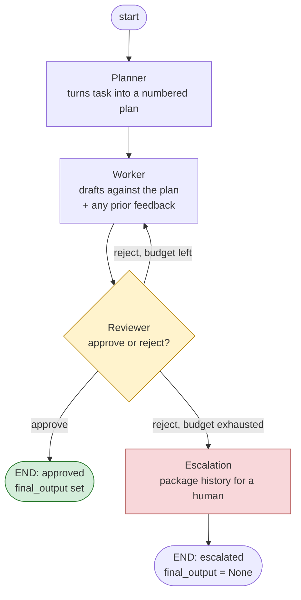

# Multi-Agent Workflow with LangGraph

A small, runnable example of specialised agents handing work to each other
through an explicit, typed state object: a **Planner**, a **Worker**, and a
**Reviewer** who can send work back for revision instead of rubber-stamping
it.

No API key required to run it — everything defaults to a deterministic
offline mock so the control flow (the actual point of this project) is easy
to inspect and test. Point it at a real Claude model with `--live` when you
want it.

## Why this shape

The task said to make the graph, not a chain. A chain (planner → worker →
reviewer → done) doesn't need a graph library at all — a few function calls
would do. What makes this a *workflow* rather than a *pipeline* is that the
reviewer isn't a rubber stamp: it can reject the draft and route control
back to the worker with concrete feedback, and the worker has to actually
use that feedback on the next pass. That loop, and the fact that it has to
terminate, is the interesting part.

## Architecture



There is exactly one conditional edge in the graph — out of `reviewer` —
and it's a real three-way decision, not a straight line dressed up as one:

| Reviewer decision | `revision_count` vs `max_revisions` | Edge taken |
|---|---|---|
| approve | — | `reviewer → END` (approved) |
| reject | still under budget | `reviewer → worker` (revise) |
| reject | budget exhausted | `reviewer → escalation → END` (escalated) |

Every other edge (`planner → worker`, `worker → reviewer`,
`escalation → END`) is unconditional.

## State schema

Defined in [`src/multiagent/state.py`](src/multiagent/state.py):

```python
class WorkflowState(TypedDict):
    task: str
    max_revisions: int

    plan: Optional[str]
    draft: Optional[str]
    review_history: List[ReviewRecord]   # every review, not just the last one
    revision_count: int
    status: Literal["planning", "drafting", "reviewing",
                     "revising", "approved", "escalated"]

    final_output: Optional[str]
    escalation_reason: Optional[str]
```

Each node returns only the fields it changes; LangGraph merges that into
the running state. The router function (`route_after_review`) never
re-derives anything — it just reads `status`, which the reviewer node set.
Keeping "what happened" (`review_history`, `revision_count`) separate from
"what to do next" (`status`) is what keeps the conditional edge a one-liner.

## The nodes

- **Planner** (`nodes.py::make_planner_node`) — turns the task into a short
  numbered plan. Doesn't touch the draft.
- **Worker** (`nodes.py::make_worker_node`) — drafts against the plan. If
  `review_history` shows the last decision was a rejection, it's handed
  that feedback (and the previous draft) explicitly, so revision isn't
  "try again from scratch and hope."
- **Reviewer** (`nodes.py::make_reviewer_node`) — the only node that writes
  `status` to one of the three terminal-ish values (`approved`, `revising`,
  `escalated`). This is where `revision_count` gets incremented and checked
  against `max_revisions`.
- **Escalation** (`nodes.py::escalation_node`) — terminal node reached only
  when the reviewer's rejections exceed the budget. It doesn't try to
  salvage anything; it packages the full review history and the last draft
  into `escalation_reason` so a human has full context.

## What happens when the reviewer rejects twice

This is the failure mode the assignment asked to find and explain, so it
gets its own file: **[`docs/failure_mode.md`](docs/failure_mode.md)**.
Short version: with `max_revisions=1` (the default), a second rejection
doesn't loop a third time — it routes to `escalation` and the graph ends
with `status="escalated"` and `final_output=None`. The alternative
(looping until approved, or looping a fixed large number of times) is
exactly the failure mode that file walks through.

## Running it

```bash
python -m venv .venv && source .venv/bin/activate
pip install -r requirements.txt

# Happy path: reviewer rejects once, worker revises, reviewer approves.
python examples/run_example.py

# Failure path: reviewer rejects twice in a row -> escalation.
python examples/run_escalation_example.py

# CLI, with your own task:
python -m multiagent.cli "Write a haiku about distributed systems" --max-revisions 1
```

Run with a real model instead of the mock:

```bash
cp .env.example .env   # then fill in ANTHROPIC_API_KEY
python -m multiagent.cli "Write a haiku about distributed systems" --live
```

Run the tests (these exercise all three edges out of the reviewer,
including escalation, without hitting any API):

```bash
pip install pytest
pytest tests/ -v
```

## Project layout

```
src/multiagent/
  state.py     # WorkflowState schema
  nodes.py     # planner / worker / reviewer / escalation node functions
  graph.py     # StateGraph wiring + the conditional edge
  llm.py       # real (Anthropic) vs mock model backends
  cli.py       # `python -m multiagent.cli "<task>"`
examples/
  run_example.py              # happy path (reject once, then approve)
  run_escalation_example.py   # failure path (reject twice -> escalate)
tests/
  test_graph.py
docs/
  failure_mode.md             # written note on double-rejection
```
